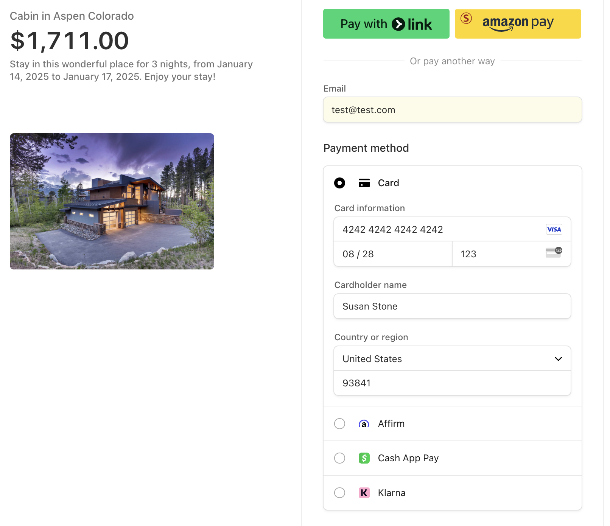
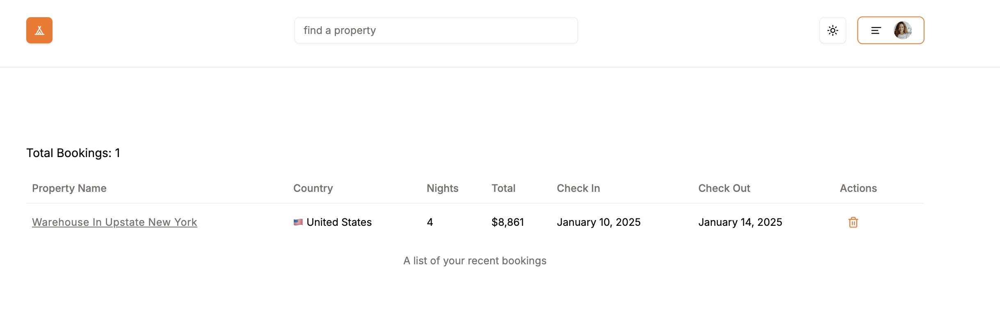
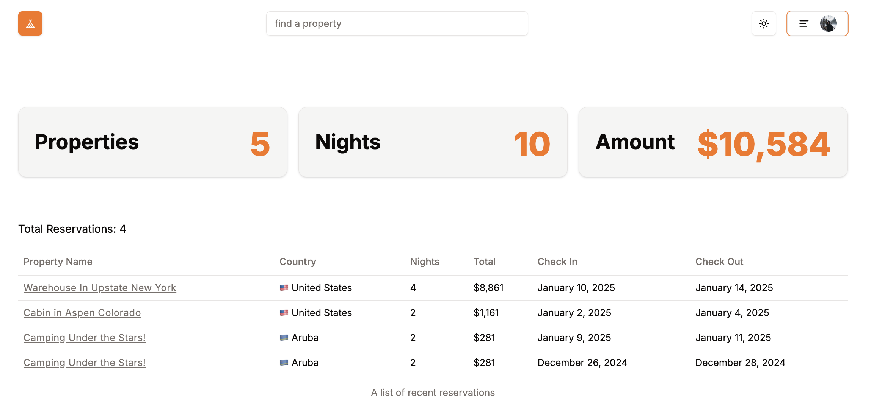
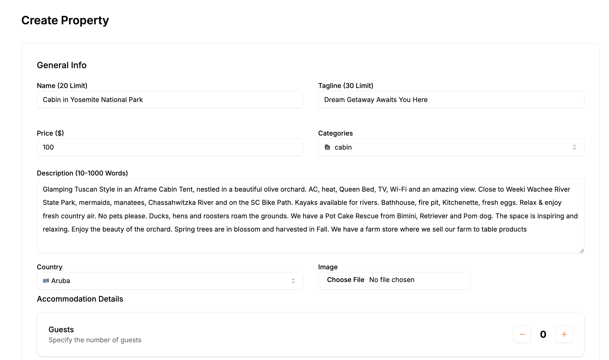

## Tranquilly (Airbnb Clone)

The following project is hosted on:

https://tranquily.vercel.app/

**Test UserName**: codeskool0@gmail.com
**Test Password**: Tranquilly123

### Tranquilly

Tranquilly is an airbnb clone that utilizes NextJS+Typescript to create a full stack application. The database used to manage all properties and users is Supabase along with Prisma as the ORM. Clerk is used for supporting OAuthentication. For payments, Stripe is used to manage all credit card payments.

### Home Page

Users are able to search by property names and taglines using the search bar as well as sort by category from the home menu to see all properties available.

### Property Details

When a property is selected the user is able to see details about the property as well as select dates to book the property. Users can also see if their dates have been booked by other users. Information is retrieved from supabase using Prisma to fetch property details based on property id selected and rendered for each page.

### Payment

Payments are handled through Stripe. Users can select dates based on a shadCN UI calendar and the summary costs will be displayed below. If the user is ready to reserve the dates a Reserve option is available where the user can input their card information, cardholder name, country, zip, and select pay to proceed.

If you would like to see this in action please use:
Email: codeskool0@gmail.com
Card Information: 4242 4242 4242 4242
Expiration Date: 08/28
Security Code: 123
Cardholder Name: Susan Stone
Country: United States
Zip: 93841

### Bookings

The bookings page displays all of the users bookings through Tranquilly. Users can also cancel the bookings by selecting the trash icon next to each booking to delete and cancel the booking.

### Reservations

If the user has properties listed the user can view all reservations for their rental properties on the reservations list and the details about each reservation as well as a summary above.The summary includes the amount of reservations, the nights booked, and total expected gross revenue on the properties.

### Create Rentals

Create rentals provides a form for users to input the property rental details. Users are able to provide a name, tagline, price per night, select a category, description, counttry, select an image, set the guests, bedrooms, beds, baths, and amenities for the property. Once information has been filled out the user can select create rental where the property will be pushed to supabase for that user and re-rendered to display the new property listing.›

