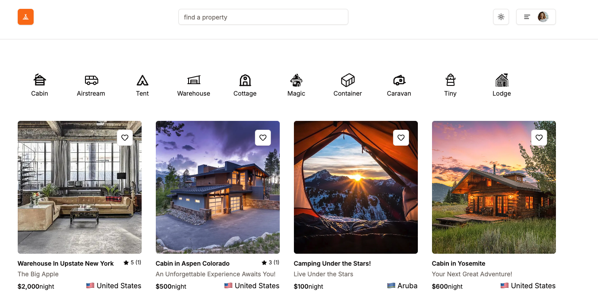
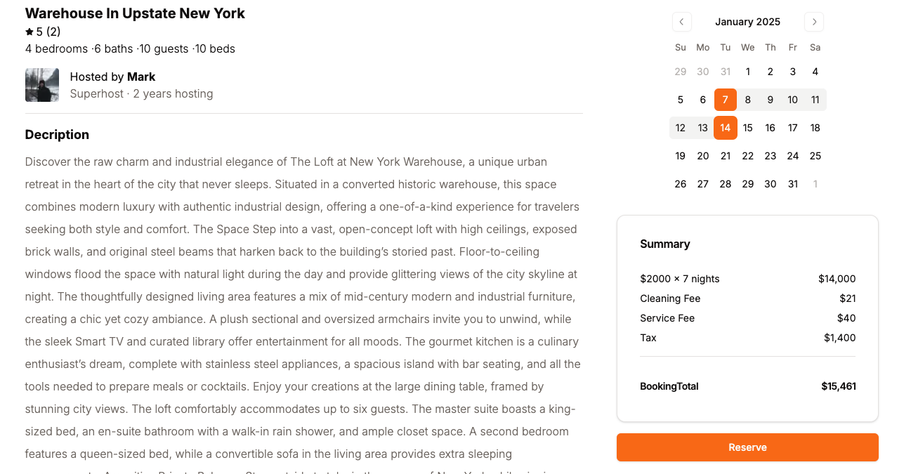

## Tranquilly (Airbnb Clone)

The following project is hosted on:

https://tranquily.vercel.app/

**Test UserName**: codeskool0@gmail.com
**Test Password**: Tranquilly123

### Tranquilly

Tranquilly is an airbnb clone that utilizes NextJS+Typescript to create a full stack application. The database used to manage all properties and users is Supabase along with Prisma as the ORM. Clerk is used for supporting OAuthentication. For payments, Stripe is used to manage all credit card payments.

### Home Page

Users are able to search by property names/taglines using the search bar as well as sort by category from the home menu to see all properties available.

### Property Details

When a property is selected the user is able to see details about the property as well as select dates to book the property. Users can also see if their dates have been booked by other users.

### Payment

Payments are handled through stripe.
